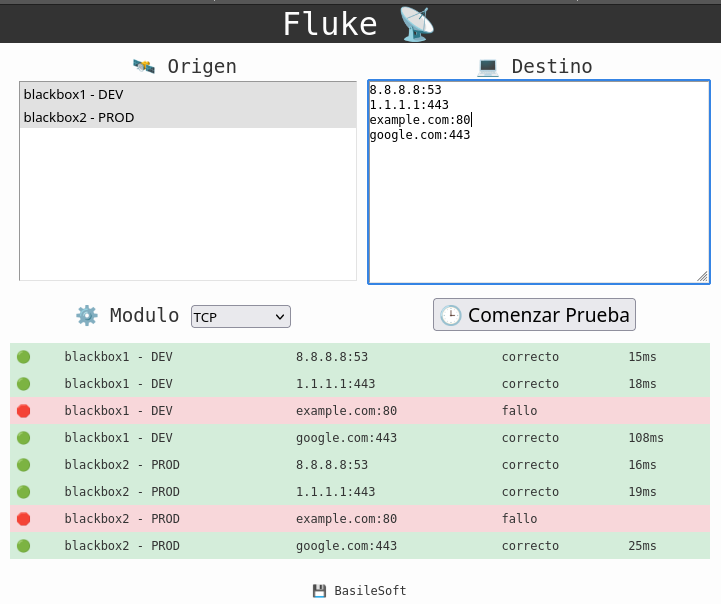

# Fluke
A blackbox concentrator to check connections.



## Run Out of the Box Setup
Clone this repository and move to new directory.
```bash
git clone git@github.com:basilean/fluke.git
cd fluke
```

Make new certificates and a random admin password.
```bash
./mkcerts.sh
```

Check new password.
```bash
cat nginx/users/READ_AND_REMOVE.txt
rm nginx/users/READ_AND_REMOVE.txt
```

Think about to save CA key and remove temporal directory.
```bash
rm -r /tmp/certs
```

Keeping working directory, open a new terminal for "nginx" and run:
```bash
./nginx.sh
```

Same for "blackbox1" running:
```bash
./blackbox1.sh
```

Same for "blackbox2" running:
```bash
./blackbox2.sh
```

Open a browser:  
[https://localhost:8443](https://localhost:8443)
